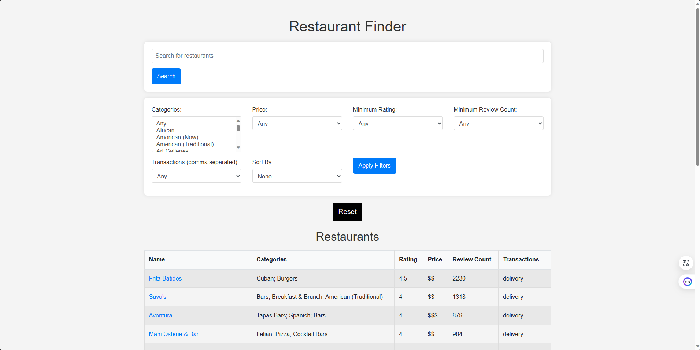
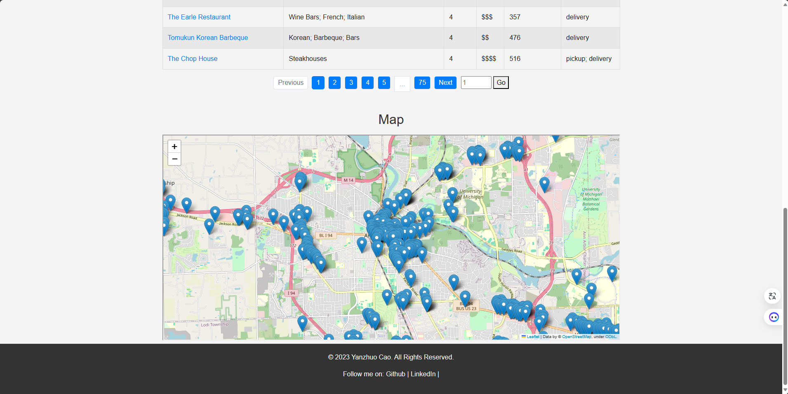
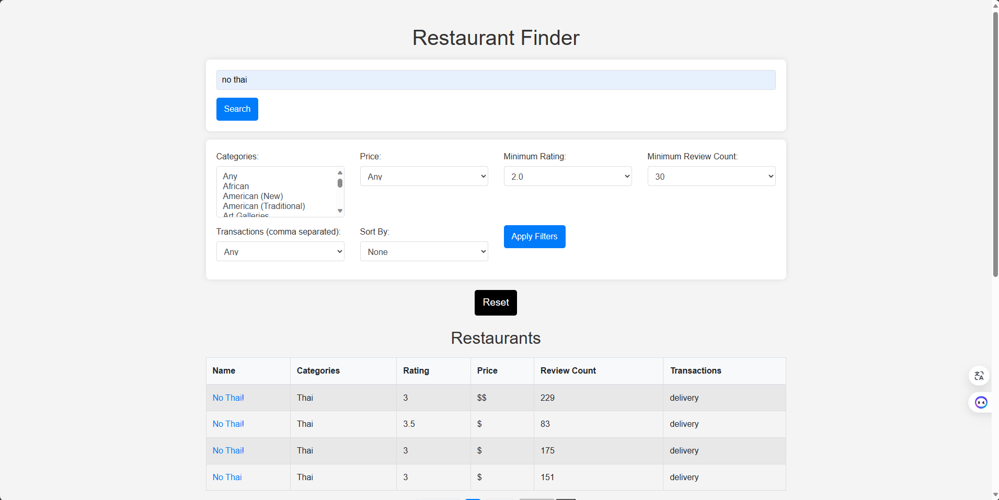
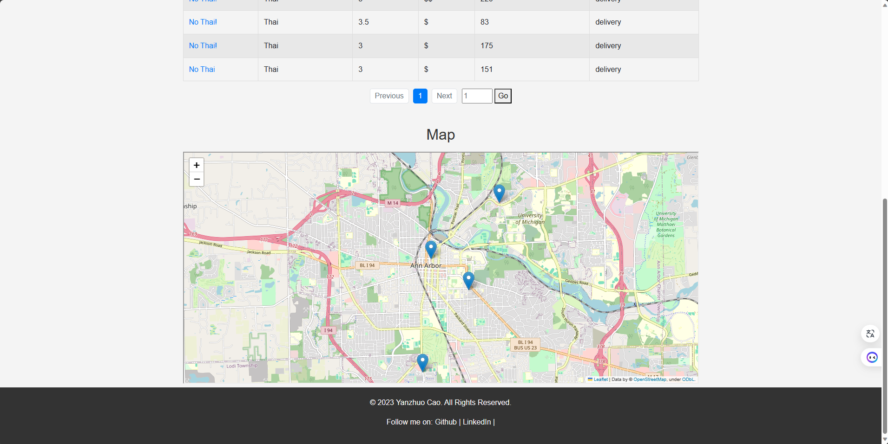
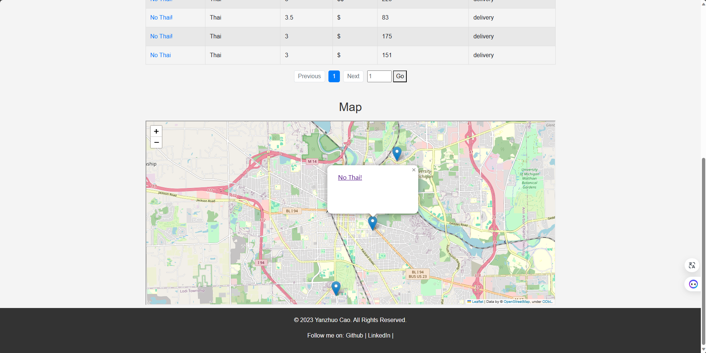

# SI507 final project - "Restaurants in Ann Arbor"
This is the final project of course SI 507, University of Michigan.

# Aim of this project 
Search specific restaurants and filter out certain types of restaurants in Ann Arbor, Michigan.

Display the result restaurants in the form of paginated list and user-interacted graph.

Allow users to go to corresponding Yelp page directly by clicking names on the list or graph.

# How to interact with the program.
1. Run Yelp.py to get the json file ann_arbor_restaurants.json. (You may need to get a new Yelp API key by yourself and replace my key with it on the Yelp Developers website)
2. Run graph_json.py to get the graph json file graph.json.
3. Run app.py to start the local user and get a web page, then you can perform the actions of search and filter. (You may need to get a new Google API key by yourself and replce my key with it on the Google API website)
4. You can either search the name of restaurants directly, filter out certain types of restaurants as you like, or do both at the same time.
5. If you want to reset all the values, you don't need to refresh the page. Instead, you just need to click the "Reset" button.
6. If you want to see the details of certain restaurant in the result list, you can just click its name, and it will redirect you to the corresponding page on the Yelp website.
7. If you want to see the details of certain restaurant on the map, you can just click the position mark and then its name, and it will redirect you to the corresponding page on the Yelp website.

Ps1: plot_graph.py is used to generate an overview of price, ranges, ratings and categories of all restaurants in Ann Arbor.

Ps2: all_xxx.py is used to see all kinds of categories, transactions, review counts of all restaurants in Ann Arbor and save the result in xxx.txt file. Then I can use the results to design the filter forms in web page. You don't need to run them to perform action of search and filter.

Ps3: The result list may be very long, so I split it by pages, with each page containing ten items. You can go to different pages by clicking the page numbers, or just type in a page number and click "Go" button.

An example output will be like this:

# Data Structure of this project - "Graph".
1. Usage of NetworkX Library:

The convert_json_map.py file imports the networkx library. This library is specifically used for creating and manipulating complex network structures, indicating that graphs are a key data structure in this project.

2. Graphs as Data Structures:

Nodes: In this project, nodes in the graphs represent individual entities such as restaurants, based on the context of the Yelp data.

Edges: The relationships or connections between these entities (restaurants) are represented as edges in the graph.

3. Graph Functionality:

The primary functionality of these graphs in the project is representing relationships or connections between different restaurants or categories within the Yelp dataset.

